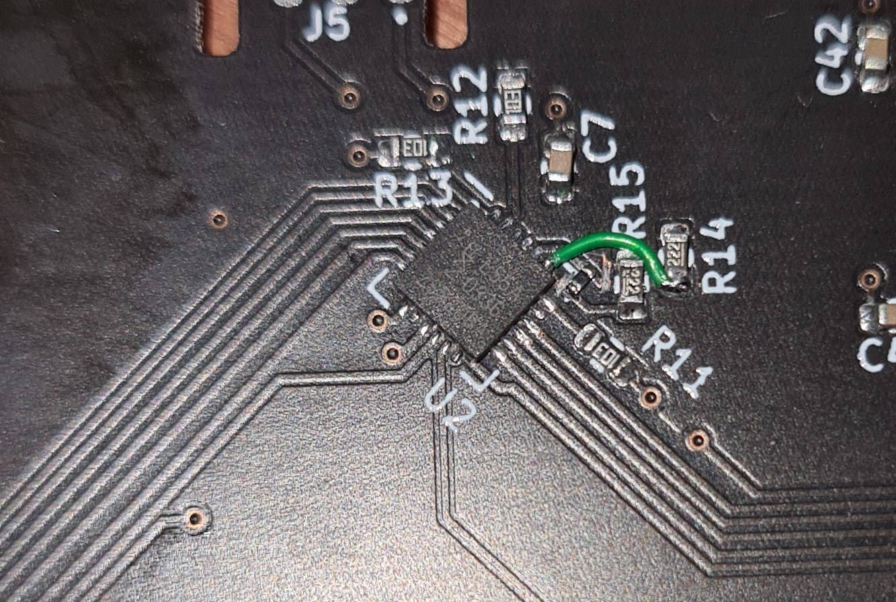

## ergonomic split v0 issues

 

1. I2C lines swapped at the PCAL9555 device

The I2C SDA/SCL lines are swapped on the PCAL9555 pins.

*Fixes:*

- For the left side, traces can be cut between the PCAL9555 pins and the I2C pull-up resistors, R14 and R15. A wire can then be soldered between the PCAL9555 I2C pins and these resistors to connect the PCAL9555 to the I2C bus correctly.

     

- For the right side, the pin swap can be done on the cable.

2. Debug edge connector pins masked

Solder mask is not removed on pads 4, 5 and 6 (bottom side of board) on the debug edge connector due to an error in the PCB footprint.

*Fixes:*

- The solder mask can be scratched away to expose the pads underneath.